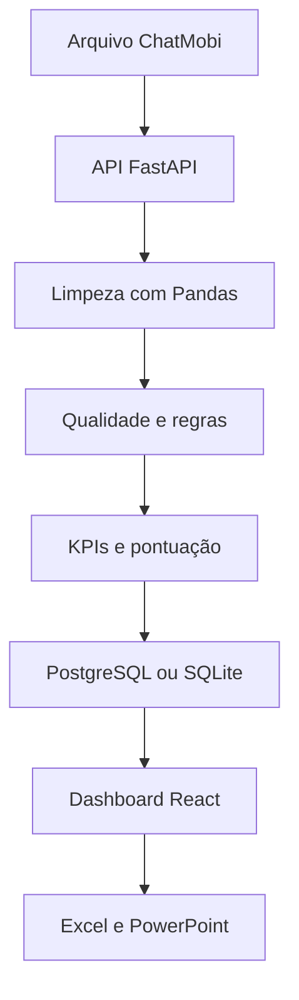

# Performance do Suporte

Dashboard web para engenharia de dados, validação mensal dos atendimentos e apuração da premiação da equipe de suporte.

[Acessar a demonstração publicada](https://support-performance-analytics.vercel.app/)

> A demonstração pública utiliza dados sintéticos. Quando `VITE_DATA_API_URL` está configurada, as importações são processadas pela API Python/Pandas e persistidas no banco central; sem a API, o motor TypeScript permanece disponível como contingência local.

## Visão geral

O projeto transforma arquivos operacionais do ChatMobi em indicadores auditáveis para apoiar o fechamento mensal da equipe. A aplicação executa um pipeline completo de leitura, limpeza, padronização, validação, transformação e apresentação dos dados.

Além de calcular a nota de cada funcionário, o sistema identifica quem atingiu a meta, seleciona os três premiados por maior nota, registra os motivos de exclusão, preserva o histórico das competências e gera relatórios em Excel e PowerPoint.

O processamento é determinístico e reproduzível: as regras aplicadas ficam registradas junto ao resultado de cada competência.

## Objetivos

- Reduzir a conferência manual da base mensal.
- Padronizar critérios que variam conforme a competência.
- Separar atendimentos válidos, excluídos e finalizados automaticamente.
- Evitar que datas de encerramento no mês seguinte alterem a competência correta.
- Calcular indicadores, pontuações, elegibilidade e ranking com memória de cálculo.
- Premiar somente o Top 3 entre os funcionários elegíveis.
- Disponibilizar painéis gerenciais, operacionais e individuais.
- Preservar rastreabilidade para conferência e auditoria.
- Exportar o resultado em formatos adequados para análise e apresentação executiva.

## Pipeline de engenharia de dados



### Etapas executadas

1. **Extração:** leitura da primeira aba de arquivos Excel ou do conteúdo de arquivos delimitados.
2. **Detecção:** identificação automática do delimitador, do cabeçalho e dos campos equivalentes.
3. **Limpeza:** normalização de textos, acentos, espaços, números, datas e linhas CSV encapsuladas.
4. **Padronização:** conversão de datas brasileiras, datas ISO e datas seriais do Excel.
5. **Validação:** aplicação do escopo, expediente, duração, atendente, competência e demais regras.
6. **Transformação:** agrupamento por funcionário e cálculo dos indicadores operacionais.
7. **Pontuação:** normalização dos critérios, cálculo da nota, elegibilidade e ranking.
8. **Carga:** gravação transacional nas tabelas de competências, resultados, válidos e exclusões.
9. **Persistência:** substituição idempotente da competência reprocessada, sem duplicar o histórico.
10. **Apresentação:** sincronização do React, atualização dos painéis, feedbacks e exportações.

## Formatos e campos reconhecidos

### Arquivos aceitos

- `.csv`
- `.txt`
- `.tsv`
- `.xlsx`
- `.xls`
- `.xlsm`

### Campos obrigatórios

| Campo lógico | Exemplos de nomes reconhecidos |
|---|---|
| Atendente | Atendente, User ID, Operador, Usuário, Agente |
| Início | Iniciado, Início, Data Início, Criado, Data, Criado em |
| Finalização | Fim, Data Última Mensagem, Última Mensagem, Finalizado |
| Departamento | Filas, Fila, Departamento, Setor, Setores ou campos Transfers |

O protocolo é opcional. Quando não está disponível, o sistema gera uma identificação baseada na linha de origem para manter a rastreabilidade.

## Regras de validação

Um atendimento pode ser excluído pelos seguintes motivos:

- Departamento diferente de Suporte.
- Atendente não informado.
- Atendente presente na lista de pessoas fora da campanha.
- Data de início inválida ou pendente.
- Data final não informada.
- Data final anterior à data inicial.
- Duração superior ao limite da competência.
- Atendimento iniciado fora do expediente permitido.
- Atendimento iniciado no domingo.

Regras complementares:

- O setor de Suporte pode aparecer em `Filas`, `Setores` ou nos campos de transferência.
- Nomes fora da campanha aceitam correspondência parcial e são informados com separação por ponto e vírgula.
- Cada registro recebe somente o primeiro motivo de exclusão, evitando dupla contagem.
- Avaliações fora da escala configurada não excluem o atendimento; elas deixam de participar da média.
- A competência é determinada pela **data de início**. Um atendimento iniciado em agosto e finalizado em `01/09` continua pertencendo a agosto.
- Se a maioria dos registros iniciados pertencer a outro mês, o processamento é bloqueado e a competência correta é informada.

## Finalizações automáticas

O sistema identifica um encerramento potencialmente automático quando:

- O horário final é exatamente `06:00`; ou
- Vinte ou mais registros possuem encerramento no mesmo minuto.

Nas competências em que os automáticos são incluídos:

- O atendimento participa da Quantidade.
- Uma avaliação válida participa do indicador de Avaliação.
- A duração artificial não participa de Tempo Total nem de TMA.
- O registro permanece identificado na auditoria.

## Regras versionadas por competência

| Período | Escala | Duração | Pesos Qtd./Tempo/TMA/Aval. | Teto | Tratamento de Tempo/TMA |
|---|---:|---:|---:|---:|---|
| Até maio/2026 | 0 a 10 | Até 8 horas | 30 / 15 / 25 / 30 | 100,00 | Componentes separados e comparativos |
| Junho/2026 | 0 a 5 | Até 9 horas | 20 / 10 / 30 / 40 | 100,00 | Componentes separados e comparativos |
| Julho/2026 | 0 a 5 | Neutralizada | 20 / 10 / 30 / 40 | 91,50 | 31,50 pontos iguais para todos |
| Agosto/2026 em diante | 0 a 5 | Até 9 horas | 20 / 10 / 30 / 40 | 91,50 | 31,50 pontos iguais para todos |

No modelo regular, o expediente é de segunda-feira a sábado, das `08:00` às `19:59`. Julho/2026 preserva os atendimentos fora dessa janela conforme a exceção histórica registrada no projeto.

Na primeira regra histórica, os 100 pontos não representam uma base fixa: **Tempo Total vale até 15 pontos e TMA vale até 25 pontos, calculados de forma independente**. Junho também mantém Tempo e TMA separados, com pesos de 10 e 30 pontos.

## Fórmulas utilizadas

Para cada funcionário `i`:

```text
Quantidadeᵢ = número de atendimentos válidos

Horas totaisᵢ = soma das durações consideradas

TMA médioᵢ = média das durações consideradas em minutos

Avaliação médiaᵢ = média das avaliações válidas
```

### Quantidade

```text
Pontos de Quantidadeᵢ =
(Quantidadeᵢ / maior Quantidade da equipe) × peso de Quantidade
```

### Tempo Total

```text
Pontos de Tempoᵢ =
(Horas totaisᵢ / maior total de Horas da equipe) × peso de Tempo
```

### TMA

Como um TMA menor representa maior eficiência:

```text
Pontos de TMAᵢ =
(menor TMA positivo da equipe / TMA médioᵢ) × peso de TMA
```

### Avaliação

```text
Pontos de Avaliaçãoᵢ =
(Avaliação médiaᵢ / maior Avaliação média da equipe) × peso de Avaliação
```

### Nota final

```text
Nota finalᵢ =
Pontos de Quantidade + Pontos de Tempo + Pontos de TMA + Pontos de Avaliação
```

### Tempo e TMA protegidos

Em julho/2026 e de agosto/2026 em diante:

```text
Pontos de Tempo = 7,88
Pontos de TMA   = 23,62
Tempo + TMA     = 31,50 pontos fixos
```

Com os pesos atuais, o teto efetivo dessas competências é:

```text
31,50 + 20,00 + 40,00 = 91,50 pontos
```

## Elegibilidade e premiação

- **Meta de elegibilidade:** nota final maior ou igual a `85 pontos`.
- **Premiação:** somente os três primeiros funcionários elegíveis.
- **Quarto elegível:** permanece identificado como elegível, mas fora das posições premiadas.

Critérios de ordenação:

1. Maior nota final.
2. Maior quantidade de atendimentos.
3. Maior avaliação média.
4. Ordem alfabética, se os critérios anteriores permanecerem empatados.

## Painéis disponíveis

| Área | Conteúdo |
|---|---|
| Projeto | Objetivo, pipeline de engenharia de dados, regras e parâmetros da competência |
| Gerencial | KPIs, ranking, comparação mensal, composição da nota e plano de acompanhamento |
| Operação | Volume, TMA mediano, TMA P90, avaliação, cobertura e detalhamento da equipe |
| Premiação | Regra oficial, ranking, formação da nota, comparação direta da liderança e memória de cálculo |
| Histórico | Evolução mensal e análise individual por funcionário |
| Auditoria | Reconciliação da base, motivos de exclusão, automáticos, parâmetros e registros válidos |
| Atualizar | Importação, seleção da competência, pessoas fora da campanha e reprocessamento |

## Histórico e feedbacks

- Cada competência é salva como um snapshot completo com parâmetros, ranking, base válida, exclusões, estatísticas e avisos.
- Reprocessar um mês substitui somente aquela competência e não cria duplicidades.
- O usuário pode selecionar competências anteriores pelo menu do sistema.
- Os feedbacks individuais são gerados por regras objetivas a partir dos KPIs e podem ser editados.
- Não existe integração com serviço de inteligência artificial na versão atual.

## Exportações

### Excel de auditoria

O arquivo Excel contém:

- `Ranking`
- `Historico_Notas`
- `Base_Validada`
- `Log_Exclusoes`
- `Resumo_Validacao`
- `Parametros_Auditoria`
- `Finalizados_Automaticos`

### PowerPoint executivo

A apresentação é gerada diretamente no navegador e inclui:

- Capa e decisão da competência.
- Indicadores centrais.
- Regras aplicadas.
- Pipeline de engenharia de dados.
- Ranking e memória de cálculo.
- Comparação mensal.
- Indicadores operacionais.
- Controle dos encerramentos automáticos.
- Análise por funcionário.
- Insights e recomendações para o próximo ciclo.

## Tecnologias utilizadas

| Camada | Tecnologias | Aplicação no projeto |
|---|---|---|
| Interface | React 19, React DOM e TypeScript 5 | Componentização, tipagem e renderização da aplicação |
| Build | Vite 7 | Servidor de desenvolvimento, otimização e compilação de produção |
| Rotas | React Router 7 | Navegação entre os painéis da SPA |
| Estilo | Tailwind CSS 3, PostCSS e Autoprefixer | Design responsivo, tema executivo e compatibilidade CSS |
| Componentes | Radix UI, shadcn/ui, CVA, clsx e tailwind-merge | Componentes acessíveis e composição das variações visuais |
| Visualização | Recharts 3 e SVG nativo | Rankings, séries mensais, indicadores e gráficos personalizados |
| Ícones e interação | Lucide React, Sonner e Framer Motion | Ícones, notificações e transições da interface |
| Integração | Fetch API e TanStack Query | Comunicação do dashboard com a API e estado assíncrono |
| Pipeline | Python 3.12 e Pandas 2 | Leitura, limpeza, normalização, qualidade, agrupamentos e cálculo dos KPIs |
| API | FastAPI, Pydantic e Uvicorn | Endpoints tipados para importação, histórico, regras e feedbacks |
| Persistência | PostgreSQL, SQLite e DB-API | Histórico central normalizado, transações e fallback de desenvolvimento |
| Contingência | TypeScript, SheetJS, Local Storage e LZ-String | Processamento e cópia local quando a API não está configurada ou está indisponível |
| Formulários | React Hook Form e Zod | Estrutura de formulários e validação tipada |
| Datas | date-fns e parser próprio | Apoio a datas e tratamento dos formatos da base importada |
| Planilhas | SheetJS (`xlsx`) | Leitura de arquivos Excel e geração da auditoria |
| Apresentações | PptxGenJS | Geração do relatório executivo em `.pptx` |
| Qualidade | Vitest, ESLint e TypeScript Compiler | Testes automatizados, análise estática e validação de tipos |
| Pacotes | pnpm | Instalação reproduzível das dependências |
| Infraestrutura | Docker, Render, GitHub e Vercel | Empacotamento da API, banco, versionamento e publicação do frontend |

### Papel do Pandas na versão atual

O Pandas voltou a ser a camada principal do processamento de dados. A API recebe CSV ou Excel, localiza o cabeçalho, converte os campos em um `DataFrame`, normaliza textos, datas e avaliações, classifica cada registro, calcula as métricas por funcionário e produz o snapshot consumido pelo React.

O motor TypeScript foi preservado como contingência e como referência de equivalência. Essa estratégia permite comparar resultados durante a migração e mantém a importação disponível caso a API central esteja temporariamente fora do ar. O modo utilizado aparece na tela após o processamento.

## Contrato da API

| Método e rota | Finalidade |
|---|---|
| `GET /health` | Saúde, versão da pipeline e mecanismo de armazenamento |
| `POST /api/v1/detectar-competencia` | Identifica a competência pela data de início |
| `POST /api/v1/competencias/processar` | Executa a pipeline e substitui a competência de forma idempotente |
| `GET /api/v1/competencias` | Sincroniza o histórico completo com o dashboard |
| `GET /api/v1/competencias/{AAAA-MM}` | Consulta um snapshot mensal |
| `PATCH /api/v1/competencias/{AAAA-MM}/feedback/{atendente}` | Atualiza o feedback individual |

## Arquitetura da aplicação

```text
backend/
├── app/main.py                  # API FastAPI e CORS
├── app/pipeline/rules.py        # Perfis versionados por competência
├── app/pipeline/engine.py       # ETL/ELT com Pandas e cálculo do ranking
└── app/database.py              # PostgreSQL/SQLite e carga idempotente

src/
├── components/                  # Layout, componentes e visualizações
├── data/support-data-runtime.ts # Adaptação dos snapshots aos painéis
├── lib/data-pipeline-api.ts     # Integração API-first com fallback local
├── lib/validation-engine.ts     # Motor TypeScript de contingência
├── lib/dashboard-store.ts       # Cache local das competências
├── lib/report-export.ts         # Excel e PowerPoint
└── pages/                       # Projeto, gestão, operação e auditoria
```

## Privacidade e persistência

- Com a API configurada, a planilha é enviada ao backend FastAPI para processamento pela pipeline Pandas.
- O histórico oficial fica no PostgreSQL e pode ser acessado pelos diferentes operadores do setor.
- `competencias`, `resultados`, `atendimentos_validos` e `exclusoes` preservam a rastreabilidade analítica.
- O navegador mantém uma cópia comprimida com LZ-String para continuidade e leitura rápida.
- Sem `VITE_DATA_API_URL`, o sistema deixa claro que está no modo local e não compartilha o histórico.
- O backend não armazena o arquivo original; persiste os dados tratados, parâmetros, resultados e evidências de auditoria.
- Recomenda-se gerar e guardar o Excel de auditoria após cada fechamento oficial.

## Execução local

Requisitos:

- Node.js 20 ou superior.
- pnpm compatível com o projeto.
- Python 3.12 ou superior.

```bash
git clone https://github.com/Pedroferreira32/support-performance-analytics.git
cd support-performance-analytics
pnpm install
python -m venv .venv
# Windows: .venv\Scripts\activate
# Linux/macOS: source .venv/bin/activate
pip install -r backend/requirements-dev.txt
uvicorn backend.app.main:app --reload --port 10000
```

Em outro terminal:

```bash
cp .env.example .env
pnpm dev
```

O frontend ficará normalmente em `http://localhost:5173`, a API em `http://localhost:10000` e a documentação interativa em `http://localhost:10000/docs`.

## Testes e build

```bash
# Executa lint, validação de tipos e testes automatizados
pnpm check

# Executa os testes da pipeline, banco e API
python -m pytest backend/tests -q

# Gera a versão otimizada para produção
pnpm build:prod
```

Os testes automatizados cobrem os perfis de regra, o teto histórico de 100 pontos, Tempo/TMA separados, validações da base, competência pela data de início, finalizações automáticas, reprocessamento idempotente, persistência, API, ranking, elegibilidade, Top 3 e geração dos arquivos Excel e PowerPoint.

## Publicação

O projeto usa dois serviços conectados pelo GitHub:

- **Vercel:** compila e publica o dashboard React.
- **Render:** constrói o `backend/Dockerfile`, executa o FastAPI e provisiona o PostgreSQL definido em `render.yaml`.

Na Vercel, `VITE_DATA_API_URL` deve apontar para a URL pública da API Render. No Render, `FRONTEND_ORIGINS` restringe o CORS ao domínio do dashboard.

Atualizações enviadas para a branch `main` podem acionar automaticamente os dois deploys. O frontend mantém o layout atual; a mudança ocorre na origem e na persistência dos dados.

---

Projeto desenvolvido como demonstração prática de **engenharia de dados, análise de dados, automação de processos, qualidade de dados e inteligência operacional** aplicada ao setor de suporte.
