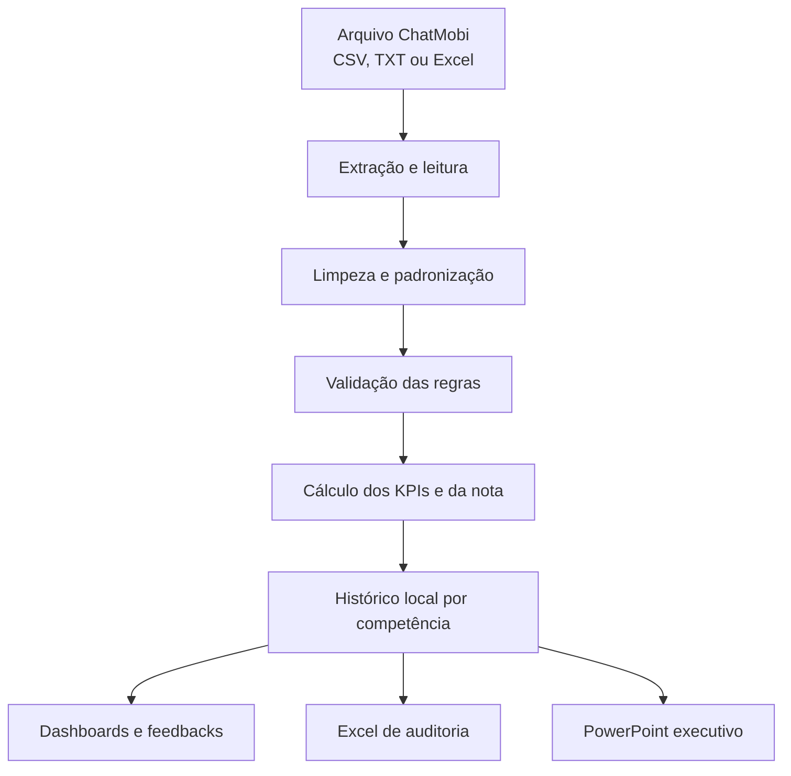

# Performance do Suporte

Dashboard web para engenharia de dados, validação mensal dos atendimentos e apuração da premiação da equipe de suporte.

[Acessar a demonstração publicada](https://support-performance-analytics.vercel.app/)

> A demonstração pública utiliza dados sintéticos. Arquivos importados pelo usuário são processados localmente no navegador e não são enviados para a Vercel ou para outro servidor.

## Visão geral

O projeto transforma arquivos operacionais do ChatMobi em indicadores auditáveis para apoiar o fechamento mensal da equipe. A aplicação executa um pipeline completo de leitura, limpeza, padronização, validação, transformação e apresentação dos dados.

Além de calcular a nota de cada funcionário, o sistema identifica quem atingiu a meta, seleciona os três premiados por maior nota, registra os motivos de exclusão, preserva o histórico das competências e gera relatórios em Excel e PowerPoint.

O processamento é determinístico e reproduzível: as regras aplicadas ficam registradas junto ao resultado de cada competência.

## Objetivos

- Reduzir a conferência manual da base mensal.
- Padronizar critérios que variam conforme a competência.
- Separar atendimentos válidos, excluídos e finalizados automaticamente.
- Evitar que datas de encerramento no mês seguinte alterem a competência correta.
- Calcular indicadores, pontuações, elegibilidade e ranking com memória de cálculo.
- Premiar somente o Top 3 entre os funcionários elegíveis.
- Disponibilizar painéis gerenciais, operacionais e individuais.
- Preservar rastreabilidade para conferência e auditoria.
- Exportar o resultado em formatos adequados para análise e apresentação executiva.

## Pipeline de engenharia de dados



### Etapas executadas

1. **Extração:** leitura da primeira aba de arquivos Excel ou do conteúdo de arquivos delimitados.
2. **Detecção:** identificação automática do delimitador, do cabeçalho e dos campos equivalentes.
3. **Limpeza:** normalização de textos, acentos, espaços, números, datas e linhas CSV encapsuladas.
4. **Padronização:** conversão de datas brasileiras, datas ISO e datas seriais do Excel.
5. **Validação:** aplicação do escopo, expediente, duração, atendente, competência e demais regras.
6. **Transformação:** agrupamento por funcionário e cálculo dos indicadores operacionais.
7. **Pontuação:** normalização dos critérios, cálculo da nota, elegibilidade e ranking.
8. **Persistência:** substituição segura da competência reprocessada, sem duplicar o histórico.
9. **Apresentação:** atualização dos painéis, feedbacks e exportações.

## Formatos e campos reconhecidos

### Arquivos aceitos

- `.csv`
- `.txt`
- `.tsv`
- `.xlsx`
- `.xls`
- `.xlsm`

### Campos obrigatórios

| Campo lógico | Exemplos de nomes reconhecidos |
|---|---|
| Atendente | Atendente, User ID, Operador, Usuário, Agente |
| Início | Iniciado, Início, Data Início, Criado, Data, Criado em |
| Finalização | Fim, Data Última Mensagem, Última Mensagem, Finalizado |
| Departamento | Filas, Fila, Departamento, Setor, Setores ou campos Transfers |

O protocolo é opcional. Quando não está disponível, o sistema gera uma identificação baseada na linha de origem para manter a rastreabilidade.

## Regras de validação

Um atendimento pode ser excluído pelos seguintes motivos:

- Departamento diferente de Suporte.
- Atendente não informado.
- Atendente presente na lista de pessoas fora da campanha.
- Data de início inválida ou pendente.
- Data final não informada.
- Data final anterior à data inicial.
- Duração superior ao limite da competência.
- Atendimento iniciado fora do expediente permitido.
- Atendimento iniciado no domingo.

Regras complementares:

- O setor de Suporte pode aparecer em `Filas`, `Setores` ou nos campos de transferência.
- Nomes fora da campanha aceitam correspondência parcial e são informados com separação por ponto e vírgula.
- Cada registro recebe somente o primeiro motivo de exclusão, evitando dupla contagem.
- Avaliações fora da escala configurada não excluem o atendimento; elas deixam de participar da média.
- A competência é determinada pela **data de início**. Um atendimento iniciado em agosto e finalizado em `01/09` continua pertencendo a agosto.
- Se a maioria dos registros iniciados pertencer a outro mês, o processamento é bloqueado e a competência correta é informada.

## Finalizações automáticas

O sistema identifica um encerramento potencialmente automático quando:

- O horário final é exatamente `06:00`; ou
- Vinte ou mais registros possuem encerramento no mesmo minuto.

Nas competências em que os automáticos são incluídos:

- O atendimento participa da Quantidade.
- Uma avaliação válida participa do indicador de Avaliação.
- A duração artificial não participa de Tempo Total nem de TMA.
- O registro permanece identificado na auditoria.

## Regras versionadas por competência

| Período | Escala de avaliação | Duração regular | Pesos Qtd./Tempo/TMA/Aval. | Tratamento de Tempo/TMA |
|---|---:|---:|---:|---|
| Até maio/2026 | 0 a 10 | Até 8 horas | 30 / 15 / 25 / 30 | Comparação relativa à equipe |
| Junho/2026 | 0 a 5 | Até 9 horas | 20 / 10 / 30 / 40 | Comparação relativa à equipe |
| Julho/2026 | 0 a 5 | Neutralizada | 20 / 10 / 30 / 40 | 31,50 pontos iguais para todos |
| Agosto/2026 em diante | 0 a 5 | Até 9 horas | 20 / 10 / 30 / 40 | 31,50 pontos iguais para todos |

No modelo regular, o expediente é de segunda-feira a sábado, das `08:00` às `19:59`. Julho/2026 preserva os atendimentos fora dessa janela conforme a exceção histórica registrada no projeto.

## Fórmulas utilizadas

Para cada funcionário `i`:

```text
Quantidadeᵢ = número de atendimentos válidos

Horas totaisᵢ = soma das durações consideradas

TMA médioᵢ = média das durações consideradas em minutos

Avaliação médiaᵢ = média das avaliações válidas
```

### Quantidade

```text
Pontos de Quantidadeᵢ =
(Quantidadeᵢ / maior Quantidade da equipe) × peso de Quantidade
```

### Tempo Total

```text
Pontos de Tempoᵢ =
(Horas totaisᵢ / maior total de Horas da equipe) × peso de Tempo
```

### TMA

Como um TMA menor representa maior eficiência:

```text
Pontos de TMAᵢ =
(menor TMA positivo da equipe / TMA médioᵢ) × peso de TMA
```

### Avaliação

```text
Pontos de Avaliaçãoᵢ =
(Avaliação médiaᵢ / maior Avaliação média da equipe) × peso de Avaliação
```

### Nota final

```text
Nota finalᵢ =
Pontos de Quantidade + Pontos de Tempo + Pontos de TMA + Pontos de Avaliação
```

### Tempo e TMA protegidos

Em julho/2026 e de agosto/2026 em diante:

```text
Pontos de Tempo = 7,88
Pontos de TMA   = 23,62
Tempo + TMA     = 31,50 pontos fixos
```

Com os pesos atuais, o teto efetivo dessas competências é:

```text
31,50 + 20,00 + 40,00 = 91,50 pontos
```

## Elegibilidade e premiação

- **Meta de elegibilidade:** nota final maior ou igual a `85 pontos`.
- **Premiação:** somente os três primeiros funcionários elegíveis.
- **Quarto elegível:** permanece identificado como elegível, mas fora das posições premiadas.

Critérios de ordenação:

1. Maior nota final.
2. Maior quantidade de atendimentos.
3. Maior avaliação média.
4. Ordem alfabética, se os critérios anteriores permanecerem empatados.

## Painéis disponíveis

| Área | Conteúdo |
|---|---|
| Projeto | Objetivo, pipeline de engenharia de dados, regras e parâmetros da competência |
| Gerencial | KPIs, ranking, comparação mensal, composição da nota e plano de acompanhamento |
| Operação | Volume, TMA mediano, TMA P90, avaliação, cobertura e detalhamento da equipe |
| Premiação | Regra oficial, ranking, formação da nota, comparação direta da liderança e memória de cálculo |
| Histórico | Evolução mensal e análise individual por funcionário |
| Auditoria | Reconciliação da base, motivos de exclusão, automáticos, parâmetros e registros válidos |
| Atualizar | Importação, seleção da competência, pessoas fora da campanha e reprocessamento |

## Histórico e feedbacks

- Cada competência é salva como um snapshot completo com parâmetros, ranking, base válida, exclusões, estatísticas e avisos.
- Reprocessar um mês substitui somente aquela competência e não cria duplicidades.
- O usuário pode selecionar competências anteriores pelo menu do sistema.
- Os feedbacks individuais são gerados por regras objetivas a partir dos KPIs e podem ser editados.
- Não existe integração com serviço de inteligência artificial na versão atual.

## Exportações

### Excel de auditoria

O arquivo Excel contém:

- `Ranking`
- `Historico_Notas`
- `Base_Validada`
- `Log_Exclusoes`
- `Resumo_Validacao`
- `Parametros_Auditoria`
- `Finalizados_Automaticos`

### PowerPoint executivo

A apresentação é gerada diretamente no navegador e inclui:

- Capa e decisão da competência.
- Indicadores centrais.
- Regras aplicadas.
- Pipeline de engenharia de dados.
- Ranking e memória de cálculo.
- Comparação mensal.
- Indicadores operacionais.
- Controle dos encerramentos automáticos.
- Análise por funcionário.
- Insights e recomendações para o próximo ciclo.

## Tecnologias utilizadas

| Camada | Tecnologias | Aplicação no projeto |
|---|---|---|
| Interface | React 19, React DOM e TypeScript 5 | Componentização, tipagem e renderização da aplicação |
| Build | Vite 7 | Servidor de desenvolvimento, otimização e compilação de produção |
| Rotas | React Router 7 | Navegação entre os painéis da SPA |
| Estilo | Tailwind CSS 3, PostCSS e Autoprefixer | Design responsivo, tema executivo e compatibilidade CSS |
| Componentes | Radix UI, shadcn/ui, CVA, clsx e tailwind-merge | Componentes acessíveis e composição das variações visuais |
| Visualização | Recharts 3 e SVG nativo | Rankings, séries mensais, indicadores e gráficos personalizados |
| Ícones e interação | Lucide React, Sonner e Framer Motion | Ícones, notificações e transições da interface |
| Estado e dados | TanStack Query, Local Storage e LZ-String | Estado da aplicação e histórico local comprimido |
| Formulários | React Hook Form e Zod | Estrutura de formulários e validação tipada |
| Datas | date-fns e parser próprio | Apoio a datas e tratamento dos formatos da base importada |
| Planilhas | SheetJS (`xlsx`) | Leitura de arquivos Excel e geração da auditoria |
| Apresentações | PptxGenJS | Geração do relatório executivo em `.pptx` |
| Qualidade | Vitest, ESLint e TypeScript Compiler | Testes automatizados, análise estática e validação de tipos |
| Pacotes | pnpm | Instalação reproduzível das dependências |
| Hospedagem | GitHub e Vercel | Versionamento, integração contínua e publicação da SPA |

## Arquitetura da aplicação

```text
src/
├── components/
│   ├── layout/          # Navegação e estrutura das páginas
│   ├── ui/              # Componentes reutilizáveis de interface
│   └── ui-ext/          # KPIs, rankings e visualizações analíticas
├── data/
│   ├── support-data.ts          # Base sintética da demonstração
│   └── support-data-runtime.ts  # Adaptação do histórico para os painéis
├── lib/
│   ├── validation-engine.ts     # Leitura, validação, cálculo e ranking
│   ├── dashboard-store.ts       # Persistência local das competências
│   └── report-export.ts         # Exportações Excel e PowerPoint
├── pages/               # Projeto, gestão, operação, premiação e auditoria
├── router.tsx           # Definição das rotas
└── main.tsx             # Inicialização da aplicação
```

## Privacidade e persistência

- O projeto não possui backend nem banco de dados remoto.
- O arquivo importado é processado dentro do navegador.
- O histórico fica no `localStorage` do navegador e é comprimido com LZ-String.
- Computadores ou navegadores diferentes não compartilham automaticamente o mesmo histórico.
- Limpar os dados do navegador remove o histórico local.
- Recomenda-se gerar e guardar o Excel de auditoria após cada fechamento oficial.

## Execução local

Requisitos:

- Node.js 20 ou superior.
- pnpm compatível com o projeto.

```bash
git clone https://github.com/Pedroferreira32/support-performance-analytics.git
cd support-performance-analytics
pnpm install
pnpm dev
```

A aplicação ficará disponível no endereço exibido pelo Vite, normalmente `http://localhost:5173`.

## Testes e build

```bash
# Executa lint, validação de tipos e testes automatizados
pnpm check

# Gera a versão otimizada para produção
pnpm build:prod
```

Os testes automatizados cobrem os perfis de regra, validações da base, competência pela data de início, finalizações automáticas, ranking, elegibilidade, Top 3 e geração dos arquivos Excel e PowerPoint.

## Publicação

O projeto está conectado ao GitHub e à Vercel. O arquivo `vercel.json` configura o build do Vite e a reescrita necessária para que as rotas da aplicação funcionem corretamente como SPA.

Atualizações enviadas para a branch `main` acionam automaticamente um novo deploy de produção na Vercel.

---

Projeto desenvolvido como demonstração prática de **engenharia de dados, análise de dados, automação de processos, qualidade de dados e inteligência operacional** aplicada ao setor de suporte.
