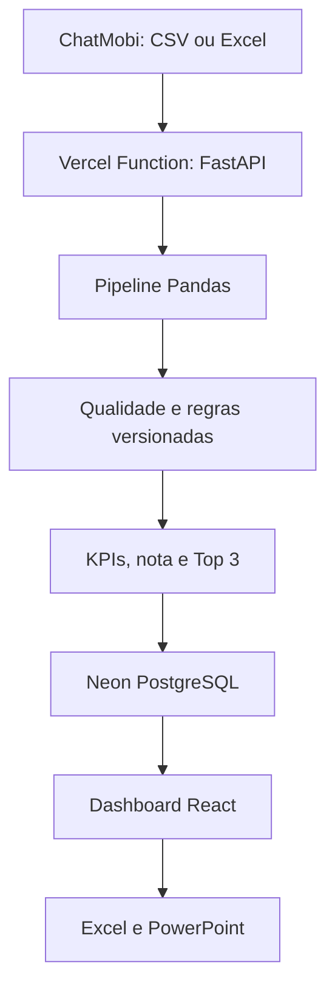

# Performance do Suporte — Validação e Premiação

Plataforma de engenharia e análise de dados para validar os atendimentos do setor de suporte, calcular indicadores de desempenho, identificar os profissionais elegíveis e premiar os três melhores resultados de cada competência.

[Acessar o dashboard em produção](https://support-performance-analytics.vercel.app/) · [Verificar a saúde da API](https://support-performance-analytics.vercel.app/api/health)

> A versão pública é um projeto de portfólio e utiliza dados sintéticos. Bases reais de funcionários não devem ser publicadas enquanto o ambiente não possuir autenticação e controle de acesso.

## Resumo executivo

O projeto nasceu para resolver um fechamento mensal que exigia conferência manual de arquivos exportados do ChatMobi. Era necessário determinar quais atendimentos realmente pertenciam ao suporte, retirar registros inválidos, respeitar as regras vigentes em cada mês, calcular a pontuação de cada funcionário e justificar de forma objetiva quem deveria receber a premiação.

A solução atual transforma a base operacional em uma decisão auditável. O sistema:

- importa arquivos CSV, TXT e Excel;
- identifica e padroniza automaticamente as colunas;
- limpa textos, números, avaliações e datas;
- aplica regras de qualidade e negócio versionadas por competência;
- calcula volume, tempo total, TMA, avaliação e cobertura de CSAT;
- determina elegibilidade a partir de 85 pontos;
- premia somente o Top 3 entre os elegíveis, por maior nota;
- registra válidos, exclusões, parâmetros, ranking e feedbacks no histórico;
- apresenta análises gerenciais, operacionais e individuais;
- exporta auditoria em Excel e relatório executivo em PowerPoint.

O resultado é um produto completo de **engenharia de dados, análise de dados, automação de processos, visualização, qualidade de dados e inteligência operacional**.

## Problema de negócio

A premiação do suporte precisava reconhecer os melhores desempenhos sem depender de fórmulas manuais ou avaliações subjetivas. A base bruta, porém, podia conter:

- atendimentos de outros departamentos;
- operadores fora da campanha;
- registros sem atendente ou sem finalização;
- datas em formatos diferentes;
- encerramentos no mês seguinte;
- durações negativas ou acima do limite;
- atendimentos fora do expediente;
- avaliações fora da escala vigente;
- finalizações automáticas que distorciam Tempo Total e TMA.

Sem um tratamento padronizado, esses casos alteravam os indicadores e poderiam mudar o ranking. O projeto foi criado para transformar essa apuração em um processo reproduzível, transparente e explicável ao responsável pelo setor.

## Decisão apoiada

Ao final de cada competência, o sistema responde:

1. Quantos registros foram importados, validados e excluídos?
2. Por que cada registro foi retirado da apuração?
3. Qual foi o desempenho de cada funcionário?
4. Quem atingiu a meta mínima de 85 pontos?
5. Quais são os três maiores resultados entre os elegíveis?
6. Quais critérios mais influenciaram a nota?
7. Quais pontos devem ser acompanhados no próximo ciclo?
8. Como o resultado evoluiu em relação aos meses anteriores?

## Evolução do projeto

### 1. Conferência manual e definição das regras

O processo começou com planilhas mensais exportadas do ChatMobi. As regras de escopo, horário, duração, avaliação e pontuação foram documentadas e conferidas manualmente para formar uma base de referência.

### 2. Automação local em Python

A validação foi automatizada em Python, com leitura de CSV/Excel, tratamento dos dados, cálculo das notas e histórico em SQLite. Essa etapa reduziu a repetição do fechamento mensal e criou uma memória de cálculo reproduzível.

### 3. Primeiras interfaces web

Foram testadas versões com Streamlit, Altair e Matplotlib. Problemas de compatibilidade entre versões do Python e das bibliotecas motivaram a criação de um ambiente isolado e, posteriormente, a substituição dessa interface.

### 4. Dashboard HTML local

O sistema evoluiu para HTML, CSS e JavaScript, executado por um servidor Python local. Foram incluídos menu lateral, KPIs, ranking, histórico individual, auditoria, feedbacks, exportação Excel e geração de PowerPoint. O acesso pela rede interna também foi preparado.

### 5. Storytelling e visual executivo

Os painéis foram reorganizados para apresentar primeiro a decisão, depois os direcionadores e, por último, as evidências. Gráficos de pizza, visuais clusterizados e elementos com leitura pouco objetiva foram removidos. A interface passou a usar comparações diretas, metas visíveis, barras ordenadas, tabelas analíticas e linguagem próxima a dashboards profissionais de Power BI.

### 6. React, TypeScript e Vite

O frontend foi reconstruído como uma SPA moderna, mantendo o layout executivo aprovado. O projeto passou a usar React, TypeScript, Vite, Tailwind CSS, shadcn/ui, Radix UI e Recharts.

### 7. Publicação e versionamento

O código foi publicado no GitHub com dados sintéticos. O Render foi utilizado durante uma fase de hospedagem e depois substituído pela Vercel, que atualmente publica o frontend e a API no mesmo domínio por integração contínua com a branch `main`.

### 8. Retorno da pipeline Python/Pandas

O layout moderno foi preservado e o processamento profissional de dados voltou ao centro da solução. A API FastAPI recebe o arquivo, a pipeline Pandas executa limpeza, validação, transformação, cálculo e carga, e o motor TypeScript permanece como contingência local.

### 9. Histórico compartilhado com Neon Postgres

A persistência local foi ampliada para um PostgreSQL gerenciado no Neon. O histórico agora pode ser centralizado e consultado por diferentes navegadores, sem depender do computador que iniciou o sistema.

### 10. Análise automatizada sem IA generativa

Uma integração experimental com Ollama foi avaliada e retirada. A versão atual gera feedbacks e recomendações por regras determinísticas baseadas nos KPIs, evitando respostas genéricas e mantendo a explicação ligada aos números realmente calculados.

## Arquitetura em produção



| Camada | Implementação atual |
|---|---|
| Origem | Arquivos operacionais CSV/TXT/XLS/XLSX/XLSM do ChatMobi |
| Processamento | Python 3.12 e Pandas 2.2 |
| API | FastAPI executada como Vercel Function |
| Persistência | Neon PostgreSQL em produção e SQLite no desenvolvimento local |
| Aplicação | React 19, TypeScript e Vite |
| Visualização | Recharts, SVG e componentes analíticos próprios |
| Exportações | SheetJS e PptxGenJS |
| Publicação | GitHub + Vercel, com deploy automático da `main` |

Em produção, o frontend chama a API pelo mesmo domínio. A variável privada `DATABASE_URL` conecta a Function ao Neon; ela nunca é exposta ao navegador nem armazenada no repositório.

## Pipeline de engenharia de dados

O fluxo segue uma estrutura ETL aplicada ao fechamento mensal:

### 1. Extração

- Recebimento do arquivo exportado do ChatMobi.
- Leitura da primeira planilha dos arquivos Excel.
- Detecção automática do delimitador dos arquivos de texto.
- Localização da linha que contém o cabeçalho real.

### 2. Padronização do esquema

- Associação de nomes diferentes ao mesmo campo lógico.
- Remoção de espaços excedentes e normalização de acentos.
- Padronização de atendente, setor, status e protocolo.
- Conversão das avaliações para valores numéricos.

### 3. Tratamento temporal

- Conversão de datas brasileiras, ISO e seriais do Excel.
- Cálculo de duração em horas e TMA em minutos.
- Determinação da competência pela data de início.
- Preservação de atendimentos iniciados no mês e finalizados no mês seguinte.

### 4. Qualidade e validação

- Classificação de cada linha como válida ou excluída.
- Registro do primeiro motivo de exclusão para impedir dupla contagem.
- Identificação de finalizações potencialmente automáticas.
- Validação da escala de avaliação correspondente ao período.
- Reconciliação entre total importado, válidos e excluídos.

### 5. Transformação e agregação

- Agrupamento dos registros válidos por funcionário.
- Cálculo de quantidade, horas, média e percentis do TMA.
- Cálculo de avaliação média e cobertura de CSAT.
- Normalização dos indicadores pelo melhor resultado da equipe.

### 6. Regra de negócio

- Aplicação do perfil correspondente à competência.
- Cálculo da nota final e do teto efetivo.
- Definição de elegibilidade.
- Ordenação do ranking e seleção do Top 3 premiado.

### 7. Carga e persistência

- Gravação transacional no PostgreSQL.
- Snapshot completo da competência.
- Substituição idempotente do mês reprocessado.
- Histórico sem duplicidade.

### 8. Consumo analítico

- Sincronização dos dados com o frontend React.
- Atualização dos painéis e feedbacks.
- Geração de Excel de auditoria e PowerPoint executivo.

## Formatos e campos reconhecidos

### Arquivos aceitos

- `.csv`
- `.txt`
- `.tsv`
- `.xlsx`
- `.xls`
- `.xlsm`

### Mapeamento de campos

| Campo lógico | Exemplos reconhecidos | Obrigatório |
|---|---|---:|
| Atendente | Atendente, User ID, Operador, Usuário, Agente | Sim |
| Início | Iniciado, Início, Data Início, Criado, Data, Criado em | Sim |
| Finalização | Fim, Data Última Mensagem, Última Mensagem, Finalizado | Sim |
| Departamento | Filas, Fila, Departamento, Setor, Setores, Transfers | Sim |
| Avaliação | Rating, Avaliação, Nota, Satisfação | Não |
| Protocolo | Protocolo, Ticket, ID | Não |
| Status | Status, Situação | Não |

Quando o protocolo não existe, o número da linha de origem é usado como identificador de auditoria.

## Regras de validação da base

Um atendimento pode ser excluído pelos seguintes motivos:

- departamento diferente de Suporte;
- atendente não informado;
- atendente presente na lista de pessoas fora da campanha;
- data de início inválida ou pendente;
- data final não informada;
- data final anterior à data inicial;
- duração superior ao limite da competência;
- atendimento iniciado fora do expediente permitido;
- atendimento iniciado no domingo.

Regras adicionais:

- Suporte pode aparecer em `Filas`, `Setores` ou campos de transferência.
- A lista de pessoas fora da campanha aceita nomes completos ou parciais separados por ponto e vírgula.
- Cada linha recebe somente o primeiro motivo de exclusão.
- Avaliações fora da escala não excluem o atendimento; apenas deixam de participar da média.
- A competência é determinada pela data de início, não pela finalização.
- Um registro iniciado em `31/08` e finalizado em `01/09` continua em agosto.
- Se a maioria dos inícios pertencer a outro mês, o sistema bloqueia o processamento e informa a competência detectada.
- Registros sem protocolo continuam rastreáveis pelo número da linha.

## Finalizações automáticas

Um atendimento é marcado como potencialmente automático quando:

- o horário final é exatamente `06:00`; ou
- pelo menos 20 registros terminam no mesmo minuto.

Nas regras que incluem automáticos:

- o registro conta em Quantidade;
- a avaliação válida participa do indicador de Avaliação;
- a duração artificial não participa de Tempo Total nem de TMA;
- o registro continua identificado na auditoria e na exportação.

Esse tratamento permite aproveitar o atendimento sem deixar que um encerramento automático distorça os indicadores de duração.

## Regras de pontuação por competência

| Período | Escala | Limite regular | Quantidade | Tempo | TMA | Avaliação | Teto | Tratamento de Tempo/TMA |
|---|---:|---:|---:|---:|---:|---:|---:|---|
| Até maio/2026 | 0–10 | 8 horas | 30 | 15 | 25 | 30 | 100,00 | Separados e comparativos |
| Junho/2026 | 0–5 | 9 horas | 20 | 10 | 30 | 40 | 100,00 | Separados e comparativos |
| Julho/2026 | 0–5 | Regra neutralizada | 20 | 7,88 fixos | 23,62 fixos | 40 | 91,50 | 31,50 iguais para todos |
| Agosto/2026 em diante | 0–5 | 9 horas | 20 | 7,88 fixos | 23,62 fixos | 40 | 91,50 | 31,50 iguais para todos |

### Modelo histórico de 100 pontos

Na primeira regra, Tempo Total e TMA **não eram somados como uma base comum**. Os quatro indicadores eram calculados separadamente:

- Quantidade: até 30 pontos;
- Tempo Total: até 15 pontos;
- TMA: até 25 pontos;
- Avaliação: até 30 pontos.

Junho/2026 também utiliza teto de 100 pontos e mantém Tempo e TMA independentes, com pesos de 10 e 30 pontos.

### Regra protegida de 31,50 pontos

Em julho/2026 e a partir de agosto/2026, Tempo e TMA recebem a mesma pontuação para todos:

```text
Tempo Total = 7,88 pontos
TMA         = 23,62 pontos
Base comum  = 31,50 pontos
```

O ranking dessas competências é decidido pelos critérios variáveis de Quantidade e Avaliação. O teto efetivo é:

```text
31,50 + 20,00 + 40,00 = 91,50 pontos
```

Julho/2026 preserva ainda os registros fora do expediente e os automáticos conforme a exceção histórica validada. De agosto/2026 em diante, o expediente regular volta a ser aplicado, mas os automáticos continuam incluídos com a duração neutralizada.

## Fórmulas utilizadas

Para cada funcionário `i`:

```text
Quantidadeᵢ = número de atendimentos válidos

Horas totaisᵢ = soma das durações consideradas

TMA médioᵢ = média das durações consideradas em minutos

Avaliação médiaᵢ = média das avaliações válidas

Cobertura CSATᵢ = avaliações válidas / atendimentos válidos × 100
```

### Pontuação de Quantidade

```text
Pontos Quantidadeᵢ =
(Quantidadeᵢ / maior Quantidade da equipe) × peso de Quantidade
```

### Pontuação de Tempo Total

```text
Pontos Tempoᵢ =
(Horas totaisᵢ / maior total de Horas da equipe) × peso de Tempo
```

### Pontuação de TMA

Como um TMA menor representa maior eficiência:

```text
Pontos TMAᵢ =
(menor TMA positivo da equipe / TMA médioᵢ) × peso de TMA
```

### Pontuação de Avaliação

```text
Pontos Avaliaçãoᵢ =
(Avaliação médiaᵢ / maior Avaliação média da equipe) × peso de Avaliação
```

### Nota final

```text
Nota finalᵢ =
Pontos Quantidade + Pontos Tempo + Pontos TMA + Pontos Avaliação
```

Os cálculos utilizam a precisão completa. A interface arredonda os valores somente para apresentação.

## Elegibilidade, ranking e premiação

- **Meta mínima:** nota final maior ou igual a 85 pontos.
- **Elegível:** funcionário que atingiu a meta.
- **Premiado:** somente um dos três primeiros elegíveis.
- **Quarto elegível:** permanece elegível, mas fora das posições premiadas.

Ordem do ranking:

1. maior nota final;
2. maior quantidade de atendimentos;
3. maior avaliação média;
4. ordem alfabética, caso o empate permaneça.

A regra separa claramente **atingir a meta** de **receber a premiação**. Mesmo que quatro ou mais pessoas alcancem 85 pontos, apenas os três maiores resultados são premiados.

## Análises e KPIs

### Qualidade da base

- total importado;
- quantidade e percentual de válidos;
- quantidade e percentual de excluídos;
- distribuição dos motivos de exclusão;
- finalizações automáticas identificadas, recuperadas e neutralizadas;
- avaliações válidas;
- reconciliação entre base importada, base premiável e exceções.

### Operação do suporte

- volume de atendimentos por funcionário;
- participação no volume da equipe;
- horas totais consideradas;
- TMA médio e mediano;
- TMA P90 para observar a cauda dos atendimentos longos;
- avaliação média;
- cobertura de CSAT;
- distribuição por horário e dia da semana.

### Performance e premiação

- nota média e mediana da equipe;
- líder da competência;
- elegíveis e premiados;
- distância individual até a meta;
- distância até o Top 3;
- composição da nota por critério;
- comparação mensal;
- ranking ordenado;
- principal alavanca de melhoria.

### Análise individual

O histórico por funcionário apresenta posição, nota, atendimentos, avaliação, componentes da pontuação e evolução entre competências. Os feedbacks são produzidos por regras objetivas que destacam:

- critério de melhor aproveitamento;
- critério com maior oportunidade;
- distância para a meta ou para o Top 3;
- ação sugerida com base nos números observados.

## Painéis do sistema

| Área | Pergunta respondida | Conteúdo principal |
|---|---|---|
| Projeto | O que foi construído e quais regras são usadas? | Objetivo, pipeline, parâmetros e metodologia |
| Gerencial | Qual decisão o responsável precisa tomar? | KPIs, ranking, comparação mensal e plano de acompanhamento |
| Operação | Como o setor está funcionando? | Volume, TMA, P90, CSAT, cobertura e distribuição operacional |
| Premiação | Quem atingiu a meta e quem será premiado? | Ranking, formação da nota, liderança e memória de cálculo |
| Histórico | Como cada pessoa evoluiu? | Série mensal, comparação individual e feedback |
| Auditoria | O resultado pode ser conferido? | Reconciliação, exclusões, automáticos, parâmetros e base validada |
| Atualizar | Como processar a próxima competência? | Upload, competência, exclusões da campanha e reprocessamento |

## Persistência e modelo de dados

O Neon PostgreSQL utiliza quatro tabelas principais:

| Tabela | Finalidade |
|---|---|
| `competencias` | Configuração, origem, estatísticas, avisos e snapshot mensal |
| `resultados` | Ranking, indicadores, nota, elegibilidade, premiação e feedback |
| `atendimentos_validos` | Registros efetivamente utilizados no cálculo |
| `exclusoes` | Registros retirados, código e descrição do motivo |

O reprocessamento é idempotente: os registros da competência informada são substituídos dentro de uma transação, sem duplicar os demais meses.

## Exportações

### Excel de auditoria

O arquivo Excel contém:

- `Ranking`;
- `Historico_Notas`;
- `Base_Validada`;
- `Log_Exclusoes`;
- `Resumo_Validacao`;
- `Parametros_Auditoria`;
- `Finalizados_Automaticos`.

### PowerPoint executivo

A apresentação é gerada diretamente no navegador e inclui:

- capa e decisão da competência;
- indicadores centrais;
- regras aplicadas;
- pipeline de engenharia de dados;
- ranking e memória de cálculo;
- comparação mensal;
- indicadores operacionais;
- controle dos automáticos;
- análise por funcionário;
- insights e recomendações.

## Tecnologias utilizadas

| Área | Tecnologias | Uso no projeto |
|---|---|---|
| Linguagem de dados | Python 3.12 | Pipeline, regras, API e persistência |
| Engenharia de dados | Pandas 2.2 | DataFrame, limpeza, transformação, qualidade, agregação e KPIs |
| Arquivos Excel | OpenPyXL e xlrd | Leitura de formatos modernos e históricos |
| Upload | python-multipart | Recebimento de arquivos pela API |
| API | FastAPI e Pydantic | Endpoints, validação de contratos e respostas tipadas |
| Servidor local | Uvicorn | Execução da API em desenvolvimento |
| Driver de banco | Psycopg 3 | Conexão transacional com PostgreSQL |
| Banco em produção | Neon PostgreSQL 18 | Histórico central, persistente e compartilhado |
| Banco local | SQLite | Desenvolvimento e testes sem infraestrutura externa |
| Frontend | React 19 e React DOM | Interface componentizada |
| Linguagem do frontend | TypeScript 5.9 | Tipagem e segurança do código |
| Build | Vite 7 | Desenvolvimento e compilação otimizada |
| Rotas | React Router 7 | Navegação da SPA |
| Dados assíncronos | Fetch API e TanStack Query | Comunicação com a API e gerenciamento das requisições |
| Interface | Tailwind CSS, shadcn/ui e Radix UI | Design responsivo e componentes acessíveis |
| Visualização | Recharts 3 e SVG | Gráficos, rankings, metas e séries históricas |
| Interação | Lucide React, Sonner e Framer Motion | Ícones, avisos e transições |
| Formulários | React Hook Form e Zod | Validação dos dados de entrada |
| Datas | date-fns e parsers próprios | Exibição e conversão de datas operacionais |
| Excel no navegador | SheetJS (`xlsx`) | Importação de contingência e exportação de auditoria |
| PowerPoint | PptxGenJS | Relatório executivo em `.pptx` |
| Cache local | Local Storage e LZ-String | Cópia comprimida para contingência no navegador |
| Testes frontend | Vitest | Regras TypeScript e exportações |
| Testes backend | Pytest | Pipeline Pandas, API e banco |
| Qualidade de código | ESLint e TypeScript Compiler | Análise estática e validação de tipos |
| Pacotes | pnpm | Instalação reproduzível do frontend |
| Versionamento | Git e GitHub | Histórico, colaboração e integração contínua |
| Hospedagem | Vercel CDN e Vercel Functions | Frontend e backend no mesmo domínio |
| Infraestrutura anterior | Render | Etapa anterior de hospedagem, substituída pela Vercel |
| Protótipos anteriores | Streamlit, Altair e Matplotlib | Primeiras versões da interface e validações visuais |

## API

| Método e rota | Finalidade |
|---|---|
| `GET /api/health` | Informa versão, pipeline, banco e persistência |
| `GET /api/v1/regras/{AAAA-MM}` | Retorna os parâmetros oficiais da competência |
| `POST /api/v1/detectar-competencia` | Detecta o mês pela data de início |
| `POST /api/v1/competencias/processar` | Executa a pipeline e grava a competência |
| `GET /api/v1/competencias` | Sincroniza o histórico completo |
| `GET /api/v1/competencias/{AAAA-MM}` | Consulta um snapshot mensal |
| `PATCH /api/v1/competencias/{AAAA-MM}/feedback/{atendente}` | Atualiza o feedback individual |

Em produção, a API é consumida pelo mesmo domínio do dashboard. Se a API estiver temporariamente indisponível, o motor TypeScript pode processar o arquivo localmente e informa que o resultado ainda não foi compartilhado com os demais navegadores.

## Estrutura do repositório

```text
backend/
├── app/main.py                  # FastAPI, endpoints e CORS
├── app/pipeline/rules.py        # Regras versionadas por competência
├── app/pipeline/engine.py       # Pipeline Pandas e cálculo do ranking
└── app/database.py              # PostgreSQL/SQLite e carga idempotente

api/index.py                     # Entrada da Vercel Function

src/
├── components/                  # Layout e componentes analíticos
├── data/support-data-runtime.ts # Adaptação dos snapshots aos painéis
├── lib/data-pipeline-api.ts     # Integração API-first e contingência
├── lib/validation-engine.ts     # Motor TypeScript equivalente
├── lib/dashboard-store.ts       # Cache local das competências
├── lib/report-export.ts         # Excel e PowerPoint
└── pages/                       # Painéis do dashboard
```

## Qualidade e testes

A suíte automatizada cobre:

- regras históricas e atuais;
- teto de 100 e de 91,50 pontos;
- Tempo Total e TMA separados no modelo histórico;
- base fixa de 31,50 pontos no modelo protegido;
- competência determinada pela data de início;
- atendimento finalizado no mês seguinte;
- filtros de setor, atendente, expediente e duração;
- correspondência parcial de pessoas fora da campanha;
- finalizações automáticas e neutralização da duração;
- avaliações fora da escala;
- elegibilidade a partir de 85;
- somente três premiados entre os elegíveis;
- desempate e ranking;
- persistência e reprocessamento sem duplicidade;
- endpoints da API;
- geração de Excel e PowerPoint.

Comandos de validação:

```bash
pnpm check
python -m pytest backend/tests -q
pnpm build:prod
```

A versão publicada foi validada com testes do frontend e backend, build de produção, saúde da API e conexão persistente com o PostgreSQL.

## Execução local

Requisitos:

- Node.js 20 ou superior;
- pnpm;
- Python 3.12 ou superior.

```bash
git clone https://github.com/Pedroferreira32/support-performance-analytics.git
cd support-performance-analytics
pnpm install
python -m venv .venv
```

Ative o ambiente virtual:

```bash
# Windows
.venv\Scripts\activate

# Linux ou macOS
source .venv/bin/activate
```

Instale e execute a API:

```bash
pip install -r backend/requirements-dev.txt
uvicorn backend.app.main:app --reload --port 10000
```

Em outro terminal, configure e inicie o frontend:

```bash
cp .env.example .env
pnpm dev
```

Endereços locais:

- frontend: `http://localhost:5173`;
- API: `http://localhost:10000`;
- documentação da API: `http://localhost:10000/api/docs`.

Sem `DATABASE_URL`, o backend local cria um banco SQLite em `backend/data/support_performance.db`.

## Publicação na Vercel

O projeto utiliza uma única implantação:

- React/Vite é distribuído pela CDN da Vercel;
- `api/index.py` empacota a FastAPI como Vercel Function;
- `/api/*` é direcionado ao backend;
- as demais rotas são entregues pela SPA;
- o Neon é acessado pela variável secreta `DATABASE_URL`;
- a branch `main` aciona o deploy automático pelo GitHub.

Variáveis principais:

| Variável | Ambiente | Finalidade |
|---|---|---|
| `DATABASE_URL` | Production e Preview | Conexão privada com o Neon PostgreSQL |
| `VITE_DATA_API_URL` | Desenvolvimento | URL do backend local; não é necessária em produção |
| `VITE_ALLOW_LOCAL_PIPELINE_FALLBACK` | Opcional | Controla o motor TypeScript de contingência |

Nunca armazene senhas ou connection strings em arquivos versionados.

## Privacidade e governança

- A demonstração pública utiliza nomes e dados sintéticos.
- O arquivo original não é mantido pelo backend.
- O banco armazena os registros tratados, parâmetros e evidências necessárias à auditoria.
- A connection string fica protegida como secret da Vercel.
- O Excel de auditoria deve ser guardado após cada fechamento oficial.
- O ambiente público atual não possui autenticação; dados reais exigem controle de acesso antes do uso operacional.

## Resultado do projeto

O sistema substitui uma validação mensal fragmentada por uma pipeline rastreável e uma camada analítica orientada à decisão. Além de identificar o Top 3 da premiação, demonstra na prática:

- engenharia e qualidade de dados;
- modelagem de regras de negócio;
- integração entre frontend, API e banco;
- análise de KPIs operacionais;
- storytelling com dados;
- automação de relatórios;
- versionamento e CI/CD;
- implantação serverless em produção.

O projeto pode ser apresentado como um case completo de **Data Engineering + Data Analytics aplicado à gestão de desempenho do suporte**.
